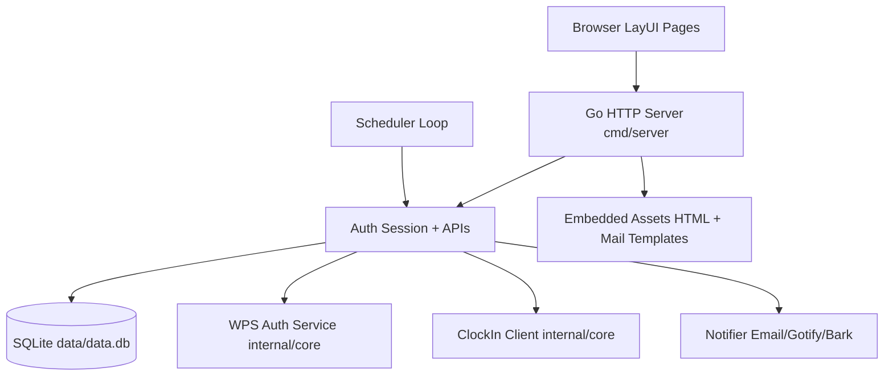

# Apparition Server Edition

Apparition is a Go-based long-running web service for WPS QR login, cookie persistence, automated clock-in scheduling, notification delivery, and audit visibility.

This repository now contains:
- legacy CLI entry: ./cmd/cli
- new web server entry: ./cmd/server

The server follows the requested layout: entrypoint in cmd/server, business code in internal/server, and reusable WPS/clock-in core in internal/core.

## 1. Feature Matrix

- User auth
  - email verification code sending
  - registration with email code
  - login/logout/session cookie
  - password change
- WPS QR login
  - create QR login session
  - backend QR image proxy (supports client timestamp query)
  - status polling
  - cookie persistence into database
- Cookie management
  - cookie status query
  - cookie deletion
- Clock-in automation
  - profile management
  - schedule job creation/update/manual run
  - run history
  - resident scheduler loop
- Notifications
  - channels: Email, Gotify, Bark
  - channel config update
  - test delivery
  - runtime event and delivery records
- Admin
  - admin pages and APIs
  - users listing
  - global run logs
  - global audit logs
- Pages and routing
  - unauthenticated page redirection to /login
  - role-checked /admin access
  - embedded static HTML pages into binary
- Runtime files
  - all external runtime data is placed next to executable under ./data

## 2. Project Layout

- ./cmd/server/main.go
  - server process entrypoint, signal handling, graceful shutdown
- ./internal/server
  - web server runtime (config, DB, auth, WPS, scheduler, notifications, APIs, pages)
- ./internal/core
  - WPS auth and KDocs clock-in low-level business logic
- ./internal/server/assets
  - embedded web pages and mail templates
- ./data (runtime generated)
  - server-config.json, data.db, logs/server.log

## 3. Runtime Architecture



### 3.1 Server startup lifecycle

1. resolve executable path
2. create data and data/logs if missing
3. create data/server-config.json on first run
4. open and migrate SQLite schema
5. ensure default admin in users table
6. initialize HTTP server and scheduler
7. start serving APIs/pages until SIGINT/SIGTERM

### 3.2 Request flow model

1. Browser requests page/API.
2. Pages are rendered from embedded assets.
3. API handlers authenticate via session cookie when required.
4. Business operations persist into SQLite.
5. Clock-in events trigger audit and optional notifications.

### 3.3 Session model

- Cookie name: apparition_session
- DB stores token hash, not plain token
- login inserts session row with expiry
- logout revokes session row
- current user is resolved by token hash + expiry + active status

### 3.4 WPS QR model

1. client creates session: POST /api/v1/wps/sessions
2. server starts WPS QR auth runtime object
3. client loads QR via proxied endpoint with ts param
4. server polls WPS scan status asynchronously
5. on confirmation, cookie JSON is stored in user_cookies

### 3.5 Scheduler model

- background ticker checks due jobs every 5 seconds
- due jobs execute clock-in using stored profile + cookies
- run records are appended to clockin_runs
- next_run_at is recalculated and persisted

## 4. Build and Run

## 4.1 Requirements

- Go 1.21+
- Windows/Linux/macOS supported by Go toolchain

## 4.2 Local development run

```bash
go run ./cmd/server
```

Important:
- runtime paths are based on executable location
- when using go run, the generated binary lives in temp build cache, so runtime data path may be outside repo

Recommended local workflow:

```bash
go build -o ./bin/apparition-server ./cmd/server
./bin/apparition-server
```

This makes runtime files deterministic at:
- ./bin/data/server-config.json
- ./bin/data/data.db
- ./bin/data/logs/server.log

## 4.3 Windows run example

```powershell
go build -o .\dist\apparition-server.exe .\cmd\server
.\dist\apparition-server.exe
```

Runtime files will be created under:
- .\dist\data\

## 4.4 Build CLI (optional)

```bash
go build -o ./bin/apparition-cli ./cmd/cli
```

## 5. Configuration

Default config file path:
- data/server-config.json (next to server executable)

Main sections:
- server: host/port and HTTP timeouts
- admin: bootstrap admin username/password hash
- security: session TTL and policy flags
- smtp: verification mail and email notifier sender config
- notifier_defaults: auto-notify policy on success/failure/security
- gotify_global/bark_global: default values (channel-level settings still stored per user)

### 5.1 Admin bootstrap behavior

- first startup creates admin in users table from config.admin
- password is stored as bcrypt hash
- default is forced password change

### 5.2 Security note

If any real SMTP password/token has been committed in config files:
- rotate credentials immediately
- avoid committing runtime data and secrets
- keep data/ excluded from source control

## 6. API Surface (high level)

- System
  - GET /healthz
  - GET /api/v1/system/bootstrap/status
- Auth
  - POST /api/v1/auth/email/send
  - POST /api/v1/auth/register
  - POST /api/v1/auth/login
  - POST /api/v1/auth/logout
  - GET /api/v1/auth/me
  - POST /api/v1/auth/change-password
- WPS
  - POST /api/v1/wps/sessions
  - GET /api/v1/wps/sessions/{id}/qr?ts=...
  - GET /api/v1/wps/sessions/{id}/status
- Cookies
  - GET /api/v1/cookies
  - DELETE /api/v1/cookies
- Clock-in
  - GET/PUT /api/v1/clockin/profile
  - GET/POST /api/v1/clockin/jobs
  - PUT /api/v1/clockin/jobs/{id}
  - POST /api/v1/clockin/jobs/{id}/run
  - GET /api/v1/clockin/runs
- Notifications
  - GET /api/v1/notify/channels
  - PUT /api/v1/notify/channels/email
  - PUT /api/v1/notify/channels/gotify
  - PUT /api/v1/notify/channels/bark
  - POST /api/v1/notify/test
  - GET /api/v1/notify/events
  - GET /api/v1/notify/deliveries
- Admin
  - POST /api/v1/admin/auth/login
  - GET /api/v1/admin/users
  - GET /api/v1/admin/runs
  - GET /api/v1/admin/logs

## 7. Pages and Redirect Rules

- /login: login page
- /register: registration page
- /dashboard: requires authenticated user
- /admin: requires authenticated admin user
- /: redirects to /login when unauthenticated, otherwise /dashboard

## 8. Data Model (core tables)

- users
- sessions
- email_verifications
- wps_login_sessions
- user_cookies
- clockin_profiles
- clockin_jobs
- clockin_runs
- notification_channels
- notification_events
- notification_deliveries
- audit_logs

## 9. Test and Validation

Run all tests:

```bash
go test ./...
```

Recommended additional checks:

```bash
go vet ./...
```

## 10. Operational Notes

- This service is stateful because of local SQLite runtime data.
- For production operation:
  - back up data/data.db periodically
  - monitor data/logs/server.log
  - keep server-config.json permissions restricted
- If deployed behind reverse proxy:
  - preserve client IP headers if needed
  - terminate TLS at proxy and enforce HTTPS externally

## 11. What Was Fixed In This Review

During this server-wide review pass, the following issues were corrected:
- fixed broken JS function nesting in dashboard page (multiple features were not reliably executed)
- fixed broken JS function nesting in admin page (log loader became nested and unstable)
- restricted user audit API to current user logs only (prevented exposure of unrelated global logs)
- hardened admin login input handling by trimming username before lookup
- added regression test ensuring user audit API only returns self-owned logs

## 12. Known Gaps and Next Hardening Steps

These are not blockers for current functionality, but are good next steps:
- implement CSRF token validation for state-changing APIs
- add login/email send rate limiter enforcement using configured limits
- improve scheduler anti-duplication strategy for clustered deployment
- add integration tests for full auth + WPS + scheduler pipeline
